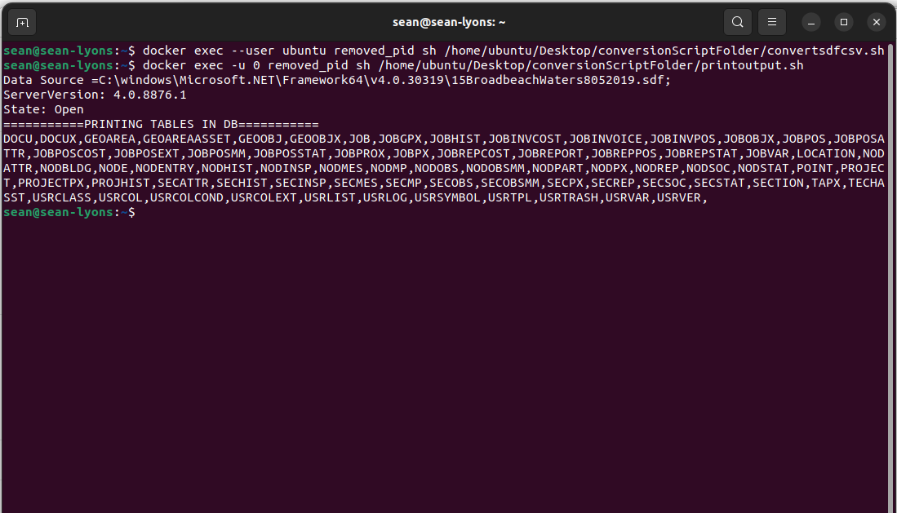

# A Windows Container



```markdown
Description: 

Steps I did for setting a Windows filesystem on top of Linux for .sdf to .csv.

Worth a note - this setup is not for the macbooks M1/M2, i.e., the aarch64/ARM64.  
It is possible, but then docker will have to be emulated with Rosetta.
```

---

**Details of the install below ⤵️**

- 1) Setting up the windows file system 🥳
    - Pulling an image and jumping into a docker container 🐳
        
        Assuming docker is installed run - `docker pull scottyhardy/docker-remote-desktop`
        
        On mac check ip with `ipconfig getifaddr en0` (if using wifi).  On linux its `hostname -I`
        
        then run-
        
        ```bash
        
        docker run -it \
            --hostname="$(hostname)" \
            --publish="3389:3389/tcp" \
            --name="remote-desktop" \
            scottyhardy/docker-remote-desktop:latest /bin/bash
        
        #can also remove the --rm flag from the command, I usually do.
        ```
        
        should look something like this
        
        
        
        Then with Remmina on Linux or Remote-Desktop on Windows/Mac remote into the container with the ip address and user name - `ubuntu` and password `ubuntu`
        
        Once in will look like this 
        
        
        
    - Installing wine & wine tricks 🍷
        
        Wine Installation
        
        Followed this series of commands
        
        ```bash
        sudo apt update && sudo apt-get update
        
        sudo apt install wget
        
        #This command is important to add 32 bit support (if this fails then stop)
        sudo dpkg --add-architecture i386
        
        sudo mkdir -pm755 /etc/apt/keyrings
        
        sudo wget -O /etc/apt/keyrings/winehq-archive.key https://dl.winehq.org/wine-builds/winehq.key
        
        sudo wget -NP /etc/apt/sources.list.d/ https://dl.winehq.org/wine-builds/ubuntu/dists/focal/winehq-focal.sources
        
        sudo apt update
        
        sudo apt install --install-recommends winehq-stable
        
        #check version
        wine --version
        ```
        
        Winetricks Installation (also install Mono when prompted. If not prompted, install Mono)
        
        ```bash
        mkdir "${HOME}/Downloads"  && cd "${HOME}/Downloads"
        
        wget  https://raw.githubusercontent.com/Winetricks/winetricks/master/src/winetricks
        
        chmod +x winetricks
        
        sudo mv winetricks /usr/local/bin
        
        wget  https://raw.githubusercontent.com/Winetricks/winetricks/master/src/winetricks.bash-completion
        
        sudo mv winetricks.bash-completion /usr/share/bash-completion/completions/winetricks
        
        sudo apt install zenity
        
        #test
        winetricks --gui
        ```
        
        Should see
        
        
        
        Configure a 32-bit file system with Windows 8
        
        ```bash
        env WINEPREFIX=$HOME/.wine32 WINEARCH=win32 winecfg
        ```
        
        After hitting OK, type `winecfg` and do the same for the 64-bit file system.
        
        
        
        After this is done check if access to a 32-bit cmd console was successful
        
        ```bash
        cd /home/ubuntu/.wine32/drive_c && env WINEPREFIX=$HOME/.wine32 WINEARCH=win32 wineconsole
        ```
        
        Should see  (ignore the console version)
        
        
        
    
- 2) Installing .Net Framework ✍️
    - Installing .NET 4.5.2 (generally a stable environment with Wine)  🪟
        
        ```bash
        sudo apt-get install cabextract
        
        winetricks dotnet452
        ```
        
        
        
        Can double check Framework installed correctly by typing `wineconsole` and then in the console type
        
        `reg query "HKLM\SOFTWARE\Microsoft\Net Framework Setup\NDP\v4" /s`
        
    - Downloading and installing drivers (Important) ✔️
        
        Microsoft SQL Server Compact 4.0 SP1 - [https://www.microsoft.com/en-us/download/details.aspx?id=30709](https://www.microsoft.com/en-us/download/details.aspx?id=30709).  Download the 64bit version
        
        
        
        After Downloaded, go to `Downloads`, and run with command `wine SSCERuntime_x64-ENU.exe`.  It is important the drivers are installed without errors.
        
        
        
    
- 3) Binaries and conversion .sdf to .csv 👍
    - Linking up driver binaries (Important) 🖇
        
        Copy all the binaries to wherever the **C# compiler** is located, i.e., these **7 binaries**, plus the **2 in the Desktop folder**
        
        
        
        The C# compiler should be located in -   `/home/ubuntu/.wine/drive_c/windows/Microsoft.NET/Framework64/v4.0.30319`
        
        The easiest way run some code and also access to the drivers is with the  **C sharp compiler** (this can also be done with the **adodbapi** python package, but then would have to install a Windows Python version, which adds a bit of bloat to the container).
        
        The only thing worth noting is **the Driver binary file has to be referenced before compilation**. 
        
        If we are going to compile a HelloWorld.cs file for example, a link to the binaries is made just before compilation **⤵️**
        
        ```bash
        #To compile C sharp code run the compiler with wine, then the name of the file, and then reference the location of driver
        
        wine /home/ubuntu/.wine/drive_c/windows/Microsoft.NET/Framework64/v4.0.30319/csc.exe \
        HelloWorld.cs \
        -r:"C:\windows\Microsoft.NET\Framework64\v4.0.30319\System.Data.SqlServerCe.dll"
        
        ```
        
    - Conversion outside the container 🏪
        
        We dont really need the GUI anymore, can just docker exec outside the container now.
        
        For example, `touch sdfToCsv.cs` in the same location the C# compiler is located
        
        some C# code just to get all the table names for any .sdf file.
        
        ```csharp
        using System.Data.SqlServerCe;
        using System;
        using System.Data;
        using System.Text;
        using System.IO;
        
        public class TableNames
        {
            public static void Main(string[] args)
            {
                //Find any .sdf files
                string[] files = System.IO.Directory.GetFiles("C:\\windows\\Microsoft.NET\\Framework64\\v4.0.30319\\", "*.sdf");
        				
        				//Writing output to csv
                using(StreamWriter writetext = new StreamWriter("sdfToCsvOutput.csv")){
        
                foreach (string file in files)
                {
                    //Initialise a connection
                    SqlCeConnection conn = null;
        
        			string connectionString = "Data Source =" + file + ";";
        
        			writetext.WriteLine(connectionString);
        
                    conn = new SqlCeConnection(connectionString);
        
                    //Open a connection and check the state
                    conn.Open();
        
                    writetext.WriteLine("ServerVersion: {0}", conn.ServerVersion);
        
                    writetext.WriteLine("State: {0}", conn.State);
        
                    //Create a data table
                    DataTable dt = new DataTable();
        
                    SqlCeDataAdapter ad;
        
                    SqlCeCommand cmd = conn.CreateCommand();
        
                    //SQL query to get table names
                    cmd.CommandText = "SELECT * FROM INFORMATION_SCHEMA.TABLES";
        
                    ad = new SqlCeDataAdapter(cmd);
        
                    ad.Fill(dt);
        
                    string tableItem = string.Empty;
        
                    string tables = string.Empty;
        
                    StringBuilder sb = new StringBuilder();
        
                    //Clean the data and remove TABLE
                    foreach (DataRow dataRow in dt.Rows)
                    {
                        foreach (var item in dataRow.ItemArray)
                        {
                            tableItem = item.ToString();
        
                            int nlen = tableItem.Length;
        
                            if (nlen >= 1 && tableItem != "TABLE")
                            {
                                sb.Append(tableItem);
                                sb.Append(",");
                            }
                        }
                    }
        
                    tables = sb.ToString();
        
        			writetext.WriteLine("===========PRINTING TABLES IN DB===========");
        
                    writetext.WriteLine(tables);
        
                    conn.Close();
        
                    //}
                    //catch (SqlException e)
                    // {
                    //     Console.WriteLine(e.ToString());
                    // }
                }
            }
        }
        }
        ```
        
         Compile the file
        
        ```bash
        #To compile C sharp code run the compiler with wine, then the name of the file, and then reference the location of driver
        
        wine /home/ubuntu/.wine/drive_c/windows/Microsoft.NET/Framework64/v4.0.30319/csc.exe \
        sdfToCsv.cs \
        -r:"C:\windows\Microsoft.NET\Framework64\v4.0.30319\System.Data.SqlServerCe.dll"
        
        ```
        
        And then run
        
        
        
        Details of the shell script producing the output can be seen below.
        
        Details of `convertsdfcsv.sh` ⤵️ 
        
        ```bash
        # bin/bash
        wine /home/ubuntu/.wine/drive_c/windows/Microsoft.NET/Framework64/v4.0.30319/sdfToCsv.exe> /dev/null 2>&1
        
        #worth a note I am redirecting the output into the abyss.  Becuase its just wine haven a yell.
        ```
        
        Details of `printoutput.sh` ⤵️
        
        ```bash
        # bin/bash
        cat /home/ubuntu/.wine/drive_c/windows/Microsoft.NET/Framework64/v4.0.30319/sdfToCsvOutput.csv
        ```
        
    - Last Important steps ☑️
        
        General goal was to run a command within a Linux env and get a .csv file.
        
        There are two last things to do/note. 
        
        1) We dont need a GUI anymore, but wine and Windows require it. To run wine headless from outside the container run the following commands ⤵️
        
        ```bash
        sudo apt install xvfb
        
        #check
        xvfb-run  --help
        
        Xvfb :0 -screen 0 1024x768x16 &
        
        export DISPLAY=:0
        
        DISPLAY=:0.0 wineconsole
        
        #This last command should just run without errors but has to be exited.
        ```
        
        2) The exec command in docker usually runs as super user, but wine is not set up to run as root.  So will have to reference the user whenever running a wine command outside the container ⤵️
        
        ```bash
        docker exec --user [container user] [container name] [command]
        ```
        
        3) If cannot RDP back in to the container to accesss the GUI - sh into container and delete both .pid files in `var/etc/xrdp/` .  Then commit a new docker image and jump back in.  XRDP probably creates the .pid files each there is session as a process is identified.  Ergo, knock em out to rdp again.
        
        ```markdown
        I ran into this issue, it was was documented here - 
        [https://github.com/scottyhardy/docker-wine/issues/104](https://github.com/scottyhardy/docker-wine/issues/104)
        
        ```